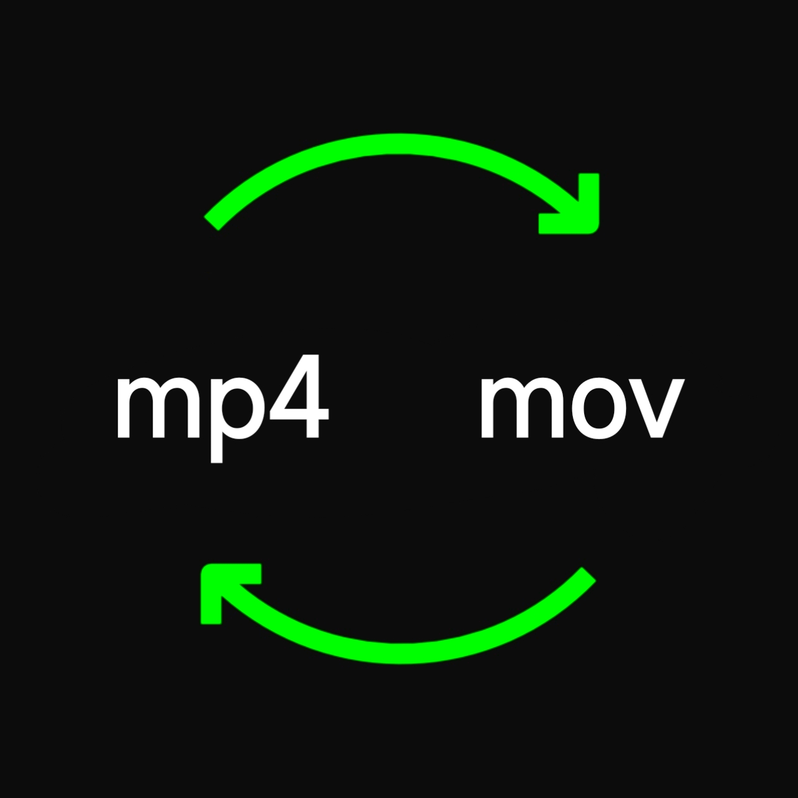

# Video Converter



A tool for converting video formats, supporting multiple formats via FFmpeg.

<p align="center">
  
  
  
</p>

## Supported Video Formats

```
MP4, MKV, MOV, AVI, FLV, WEBM, MPEG, MPG, M4V, WMV, OGV, VOB, 3GP, 3G2, M2V, TS, MTS, M2TS, F4V, ASF, RM, RMVB, WTV, SWF, AMV, MXF, DV, GXF, NUT, GIF, H264, HEVC, VC1, AVS2, AVS3, VVC
```
---

<p align="center">
  
  
</p>
